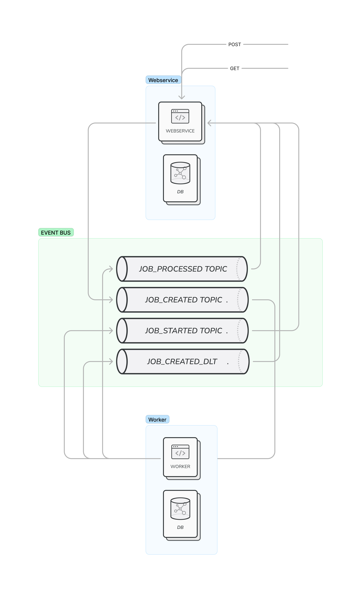

# VULNERABILITIES SCANNER

This is a monorepo for vulnerabilities scanning application.

## Techstack

- Turborepo
- NestJs
- Mongodb
- Kafka

## Build

- `pnpm install` in the root (`pnpm install -f` if you are on arm arch)
- `pnpm build` this will build all packages and apps

## Start Development Instances

- need kafka and mongodb beforehand
- rename **.env** to **.env.development** and fill out local env variables
- `pnpm start:dev` and should be good to go

## Test

- `pnpm test` in the root will test all packages and apps
- `pnpm test --filter=worker` for worker test and the same goes for others

## Usage
 - POST to `/scan` to queue a job with body 
 ```
 { repoName: [string] }
 ``` 
 - GET to `/scan/:id` 

## Apps And Packages

- **webservice** `apps/webservice` : user facing service to push job to message bus
- **worker** `apps/worker`: service that actually processes the job
- **@gr-asmt/tsconfig** `tools/tsconfig`: tsconfig for the whole monorepo
- **@gr-asmt/estlint** `tools/eslint-config`: eslint rules for the whole monorepo
- **@gr-asmt/prettier** `tools/prettier`: prettier rules for the whole monorepo
- **@gr-asmt/schemas** `packages/schemas`: mongoose schemas for both services
- **@gr-asmt/utils** `packages/utils`: package in which topic constants, utils function and ts interfaces reside

## Architectural Planning

Application comprises of two main components. User facing webserice and scanner worker.
Since scan job for worker might actually take several mins to hour. The best way to deal with this situation is to decouple worker process from webservice and make it async. In that case, a message bus will be needed and kafka is choosen for this.
Here is what will be the process of a scan.

- Frist, user will call the post endpoint of webservice to put the job.
- Webservice will create a db entry and dispatch an event about createdJob.
- Consumer from worker for that event will pick up the job, acknowledge the job by dispatching another event like jobStarted, and will continue to process the job asynchronously. By the time worker finised the processing, it will emit jobPorcessed event to respective topic with the scan result.
- Respective consumer from webservice will pick up the result and capture the data change.
- If something went wrong during processing, the job will be push to dead letter topic to examine or reprocess by admin later. Dead letter topic consumer from webservice will capture the event and update the job with error .

**This application doesn't cover reliable reprocessing upon failure.**


